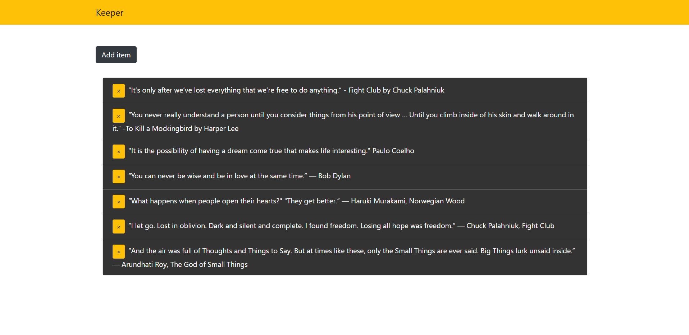

# Keeper

A simple full stack application with MERN.

## Resources

I watched a bunch of youtube videos from [Traversy Media](https://www.youtube.com/user/TechGuyWeb) channel and made these scripts.

```bash
# Install dependencies for server
npm install

# Install dependencies for client
npm run client-install

# Run the client & server with concurrently
npm run dev

# Run the Express server only
npm run server

# Run the React client only
npm run client

# Server runs on http://localhost:5000 and client on http://localhost:3000
```


